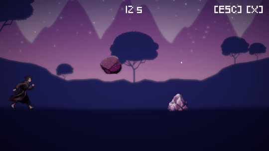

 

  

    
  

 

  

# 

This Pygame project is a simple 2D infinite runner game. The player controls a character who automatically runs through a side-scrolling world. The goal is to avoid obstacles by timing jumps accurately. In the game menu, you can see your best score and adjust settings.

 
 

  

## Controls

Space for jumping and starting a new game. Escape or [ESC] button to toggle the pause menu. Drag the corners or sides of the window to resize. Quit the game by clicking the [X] button.

## Menu settings

• Toggle fullscreen

• Toggle music

• Toggle sounds

• Reset best score

## Credits

• Background sky graphics by <a href="https://www.freepik.com/free-vector/wanderlust-travel-landscapes_5667591.htm#query=pixel%20sky%20background&position=11&from_view=keyword&track=ais">gstudioimagen</a> on Freepik

• In-game font by <a href="https://www.dafont.com/omegapc777.d6598">OmegaPC777</a> on Dafont

• Player and stones graphics were created via <a href="https://www.bing.com/create">Bing Image Creator</a>

• Jump sound effect taken from <a href="https://www.youtube.com/watch?v=QmCfnTtM7vU">here</a>

• Game over sound effect taken from <a href="https://www.youtube.com/watch?v=bug1b0fQS8Y">here</a>

• I am the author of the theme song. Its full version is available <a href="https://on.soundcloud.com/C6pCU">here</a>

